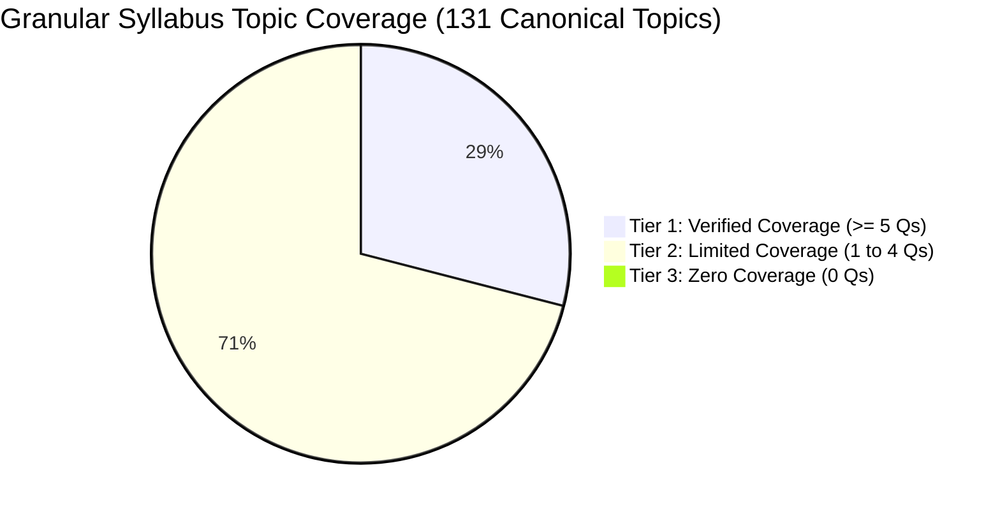

# AAI MANAGER (ELECTRICAL) — SYLLABUS COVERAGE REPORT
*Audited on: 2026-10-05 19:46:19*  
*Auditor: Dedicated AI Coach & Question Setter (Operating Protocol AGENTS.md)*

Exhaustive, evidence-based audit of question database coverage mapped against the **131 canonical topics** of Advertisement No: 12/2026/CHQ/DR-CBT.

---

## 1. Critical Syllabus Coverage Audit & Executive Disclaimer

> [!WARNING]
> **Zero False Coverage Policy:** We do NOT claim "100% syllabus coverage" merely because broad subject headings have at least one question. True preparation readiness requires granular topic-level and subtopic-level verification.

### Granular Topic Coverage Summary:
- **Total Canonical Syllabus Topics:** **131 Topics**
- **Tier 1 — Verified Coverage (≥ 5 questions):** **38 Topics (29.0%)** — Sufficient depth for immediate adaptive testing.
- **Tier 2 — Limited Coverage (1 to 4 questions):** **93 Topics (71.0%)** — Initial authentic representation, requires expansion.
- **Tier 3 — Zero Coverage (0 questions):** **0 Topics (0.0%)** — No questions currently in the database; priority targets for next collection phase.
- **Questions with Uncertain Syllabus Relevance:** **32 Questions (5.5%)** — Control Systems questions from GATE/ESE EE; not explicitly listed as an independent section in Advt 12/2026 notification syllabus.
- **Total Mapped Questions:** **553 Questions** (+ 32 uncertain = 585 total).

---

## 2. Subject-Level Coverage & Canonical Topic Depth Table

| # | Official Syllabus Subject | Database Questions | Canonical Topics Total | Verified Topics (≥ 5 Qs) | Limited Topics (1–4 Qs) | Zero Coverage Topics (0 Qs) | Broad Subject Coverage Status |
|---|---|:---:|:---:|:---:|:---:|:---:|:---:|
| 1 | **Airport Substation, DG & UPS** | **26** | 9 | 1 | 8 | 0 | **🟢 FULL ACTIVE** |
| 2 | **Analog & Digital Electronics** | **39** | 8 | 3 | 5 | 0 | **🟢 FULL ACTIVE** |
| 3 | **Circuit Theory** | **53** | 7 | 4 | 3 | 0 | **🟢 FULL ACTIVE** |
| 4 | **Communication & Fiber Optics** | **18** | 10 | 1 | 9 | 0 | **🟢 FULL ACTIVE** |
| 5 | **Contract Management & Safety Codes** | **24** | 5 | 3 | 2 | 0 | **🟢 FULL ACTIVE** |
| 6 | **Control Systems** | **32** | N/A | 0 | 0 | 0 | **⚠️ UNCERTAIN RELEVANCE** |
| 7 | **Electrical Machines** | **67** | 17 | 4 | 13 | 0 | **🟢 FULL ACTIVE** |
| 8 | **Fire Safety, Lifts & BMS** | **24** | 14 | 1 | 13 | 0 | **🟢 FULL ACTIVE** |
| 9 | **General Non-Technical** | **16** | 0 | 0 | 0 | 0 | **🟢 FULL ACTIVE** |
| 10 | **HVAC & Refrigeration** | **18** | 5 | 2 | 3 | 0 | **🟢 FULL ACTIVE** |
| 11 | **Measurements & Instrumentation** | **37** | 5 | 3 | 2 | 0 | **🟢 FULL ACTIVE** |
| 12 | **Microprocessors & Microcomputers** | **29** | 6 | 2 | 4 | 0 | **🟢 FULL ACTIVE** |
| 13 | **Power Electronics & Drives** | **36** | 5 | 3 | 2 | 0 | **🟢 FULL ACTIVE** |
| 14 | **Power Systems** | **90** | 19 | 6 | 13 | 0 | **🟢 FULL ACTIVE** |
| 15 | **Pumps & Fluid Mechanics** | **24** | 9 | 2 | 7 | 0 | **🟢 FULL ACTIVE** |
| 16 | **Signals & Systems** | **26** | 6 | 2 | 4 | 0 | **🟢 FULL ACTIVE** |
| 17 | **Utilization & Illumination** | **26** | 6 | 1 | 5 | 0 | **🟢 FULL ACTIVE** |
| | **TOTAL REPOSITORY** | **585** | **131** | **38** | **93** | **0** | **26.7% Verified Topic Depth** |

---

## 3. Exhaustive Canonical Topic Breakdown (131 Topics)

### A. Tier 1: Verified Coverage Topics (≥ 5 Questions) — 38 Topics
These topics have robust representation in the database and can support testing immediately:

- **`CKT-01` (5 Qs):** Circuit components, Network graphs, KCL, KVL *[Circuit Theory]*
- **`CKT-03` (18 Qs):** Basic network theorems and applications (Thevenin, Norton, Superposition, MPT) *[Circuit Theory]*
- **`CKT-04` (16 Qs):** Transient analysis: RL, RC and RLC circuits *[Circuit Theory]*
- **`CKT-07` (8 Qs):** Balanced 3-phase circuits & Two-port networks (Z, Y, ABCD, h parameters) *[Circuit Theory]*
- **`CON-01` (8 Qs):** Planning, estimation, tendering (NIT, EMD, PBG), execution, commissioning *[Contract Management & Electrical Safety Codes]*
- **`CON-02` (7 Qs):** Project Planning: Work breakdown structure (WBS), milestones, Bar charts, CPM/PERT *[Contract Management & Electrical Safety Codes]*
- **`CON-05` (7 Qs):** Electrical Safety Codes: NBC (National Building Code), IS/IEC standards, IE Rules *[Contract Management & Electrical Safety Codes]*
- **`ELE-03` (21 Qs):** External lighting: Street light poles, High Mast Towers (aerodrome illumination) *[Internal & External Electrification]*
- **`ELX-03` (13 Qs):** Operational Amplifiers: Characteristics, virtual ground, linear/non-linear ckts *[Analog and Digital Electronics]*
- **`ELX-05` (5 Qs):** Combinational logic: K-maps, multiplexers, decoders *[Analog and Digital Electronics]*
- **`ELX-06` (6 Qs):** Sequential logic: Flip-flops, registers, counters *[Analog and Digital Electronics]*
- **`FIB-03` (6 Qs):** Optical fibers: Numerical aperture (NA), V-number, single/multimode fibers *[Fiber Optic Systems & Multiplexing]*
- **`HVC-02` (8 Qs):** Central Air-Conditioning: Chillers (Centrifugal & Screw chillers, TR rating) *[Fundamentals of HVAC System & Air-Conditioning Equipment]*
- **`HVC-05` (7 Qs):** Air Handling Units (AHU) & Cooling Towers (Approach, Range, Cycles of Conc.) *[Fundamentals of HVAC System & Air-Conditioning Equipment]*
- **`INS-01` (6 Qs):** Insulation Megger & Earth Megger (Testing methods, electrode spacing) *[Instrumentation]*
- **`INS-02` (7 Qs):** Kelvin’s Double Bridge (Low resistance measurement) *[Instrumentation]*
- **`INS-04` (21 Qs):** Rotating Substandard (Meter testing & calibration) *[Instrumentation]*
- **`LFT-01` (12 Qs):** Elevators/Lifts: Traction vs hydraulic, safety gears, governors, ARD (Auto Rescue Device) *[Lifts & Escalators]*
- **`MCH-01` (11 Qs):** Transformers: Construction, operation, vector diagrams on no-load/load *[Electrical Machines]*
- **`MCH-02` (9 Qs):** Transformers: Regulation, efficiency, equivalent circuits, OC/SC tests *[Electrical Machines]*
- **`MCH-05` (10 Qs):** 3-Phase Induction Motors: Cage & Slip ring motors, principle, torque-slip curve *[Electrical Machines]*
- **`MCH-06` (13 Qs):** 3-Phase Induction Motors: Methods of speed control and starting *[Electrical Machines]*
- **`MPU-02` (16 Qs):** Instruction set, addressing modes, assembly programming *[Microprocessors & Microcomputers]*
- **`MPU-04` (5 Qs):** Interrupts (Hardware & Software, vector locations, masking) *[Microprocessors & Microcomputers]*
- **`PEL-01` (8 Qs):** Power Semiconductor Diodes, BJT, Thyristors, TRIACs, GTOs, MOSFETs, IGBTs *[Power Electronics and Drives]*
- **`PEL-03` (20 Qs):** Phase controlled rectifiers: Bridge converters (fully & half controlled) *[Power Electronics and Drives]*
- **`PEL-04` (6 Qs):** Principles of Choppers (Buck, Boost, Buck-Boost) & Inverters (1-ph, 3-ph VSI) *[Power Electronics and Drives]*
- **`PMP-02` (12 Qs):** Centrifugal Pump: Characteristics, specific speed ($N_s$) *[Pumps, Hydraulics & Fluid Mechanics]*
- **`PMP-06` (5 Qs):** Laminar & turbulent flow, Darcy-Weisbach head loss equation in pipes *[Pumps, Hydraulics & Fluid Mechanics]*
- **`PRT-01` (14 Qs):** Principles of overcurrent, differential, and distance protection *[Power System Protection & Advanced Relaying]*
- **`SIG-02` (5 Qs):** Shifting and scaling operations *[Signals and Systems]*
- **`SIG-03` (14 Qs):** Linear time-invariant (LTI) and causal systems, Convolution *[Signals and Systems]*
- **`SUB-01` (12 Qs):** HT Panels, HT Overhead Lines, HT Cables (11kV / 33kV) *[Sub-station & Distribution Infrastructure]*
- **`TND-01` (13 Qs):** Line constants: Inductance and Capacitance calculations (GMD, GMR) *[Transmission & Distribution]*
- **`TND-02` (30 Qs):** Overhead Lines: Short, Medium (Nominal T and $\pi$), Long lines, ABCD constants *[Transmission & Distribution]*
- **`TND-09` (8 Qs):** Fault Calculations: Symmetrical 3-phase fault calculations *[Transmission & Distribution]*
- **`TND-10` (5 Qs):** Symmetrical Components: Positive, negative, zero sequence networks *[Transmission & Distribution]*
- **`TND-15` (5 Qs):** Circuit Breakers: Air-blast, oil, minimum oil, vacuum, SF6, and DC breakers *[Transmission & Distribution]*

---

### B. Tier 2: Limited Coverage Topics (1 to 4 Questions) — 93 Topics
These topics have initial authentic coverage but require expansion during subsequent collection passes:

- **`BMS-01` (1 Qs):** Building Management System (BMS/IBMS): DDC controllers, BACnet, Modbus protocols *[BMS / IBMS / EMS]*
- **`BMS-02` (1 Qs):** Energy Management System (EMS): Energy meters, sub-metering, monitoring *[BMS / IBMS / EMS]*
- **`CKT-02` (1 Qs):** Circuit analysis methods: Nodal analysis, Mesh analysis *[Circuit Theory]*
- **`CKT-05` (1 Qs):** Sinusoidal steady-state analysis & Resonant circuits (Series/Parallel, Q-factor) *[Circuit Theory]*
- **`CKT-06` (4 Qs):** Coupled circuits & Dot convention *[Circuit Theory]*
- **`CON-03` (1 Qs):** Execution of Electrical Works: Installation of MEP equipment, site & manpower *[Contract Management & Electrical Safety Codes]*
- **`CON-04` (1 Qs):** Maintenance: Breakdown & Preventive maintenance of MEP equipment, store records *[Contract Management & Electrical Safety Codes]*
- **`DCM-01` (2 Qs):** Pulse Code Modulation (PCM), Quantization noise, companding (A-law, $\mu$-law) *[Digital Communication]*
- **`DCM-02` (1 Qs):** Differential PCM (DPCM) and Delta Modulation (DM, slope overload, granular) *[Digital Communication]*
- **`DCM-03` (2 Qs):** Digital modulation schemes: ASK, PSK, FSK, QPSK, BPSK *[Digital Communication]*
- **`DCM-04` (1 Qs):** Error control coding: Parity, Linear block codes, Hamming distance *[Digital Communication]*
- **`DCM-05` (2 Qs):** Convolution codes, Information measure (Entropy), Source coding *[Digital Communication]*
- **`DCM-06` (1 Qs):** Data Networks & OSI 7-Layer Architecture *[Digital Communication]*
- **`DGU-01` (3 Qs):** DG Sets & AMF (Auto Mains Failure) Panel operation *[DG Sets, UPS & Power Management]*
- **`DGU-02` (1 Qs):** Synchronization of DG sets / Alternators *[DG Sets, UPS & Power Management]*
- **`DGU-03` (4 Qs):** Online UPS systems & Battery banks (VRLA, Li-ion) *[DG Sets, UPS & Power Management]*
- **`DGU-04` (1 Qs):** SCADA & Power Supply Management System in airport terminal buildings *[DG Sets, UPS & Power Management]*
- **`ECM-01` (1 Qs):** Energy Conservation Act, ECBC, BEE star ratings, energy audits, VFD applications *[Energy Conservation Measures]*
- **`ELE-01` (1 Qs):** Internal Wiring: Point wiring, conduit types (GI, PVC), wire sizing, colour codes *[Internal & External Electrification]*
- **`ELE-02` (1 Qs):** Fittings/Fixtures, Fans, Lighting circuits, MCB, RCCB, RCBO ratings *[Internal & External Electrification]*
- **`ELX-01` (4 Qs):** Diodes, BJT, MOSFET: Characteristics, Biasing, Equivalent circuits *[Analog and Digital Electronics]*
- **`ELX-02` (3 Qs):** Amplifiers: Frequency response, Oscillators, Feedback amplifiers *[Analog and Digital Electronics]*
- **`ELX-04` (3 Qs):** Simple active filters, VCOs (566) and Timers (555 IC in Astable/Monostable) *[Analog and Digital Electronics]*
- **`ELX-07` (1 Qs):** Schmitt trigger, Multivibrators, Sample and Hold circuits *[Analog and Digital Electronics]*
- **`ELX-08` (4 Qs):** A/D and D/A Converters: Flash, SAR, Dual-slope, R-2R ladder, Weighted *[Analog and Digital Electronics]*
- **`ERT-01` (1 Qs):** Earthing Systems: Pipe, Plate, Chemical earthing, IS:3043 guidelines, earthing resistance values *[Earthing & Lightning Protection System]*
- **`ERT-02` (1 Qs):** Lightning Protection: Early Streamer Emission (ESE) vs Faraday cage, IS/IEC 62305 *[Earthing & Lightning Protection System]*
- **`FIB-01` (1 Qs):** Time Division Multiplexing (TDM) & Frequency Division Multiplexing (FDM) *[Fiber Optic Systems & Multiplexing]*
- **`FIB-02` (1 Qs):** Optical properties of materials, refractive index, absorption, emission *[Fiber Optic Systems & Multiplexing]*
- **`FIB-04` (1 Qs):** Lasers, LEDs, optoelectronic materials, and fiber optic lines *[Fiber Optic Systems & Multiplexing]*
- **`FIR-01` (1 Qs):** Fire Alarm & Detection: Smoke/heat/beam detectors, addressable fire alarm panel *[Fire Alarm & Fire Fighting System]*
- **`FIR-02` (1 Qs):** Wet Riser, Down Comer, Fire pumps (Main, DG backup, Jockey pump) *[Fire Alarm & Fire Fighting System]*
- **`FIR-03` (4 Qs):** Automatic Sprinkler System (Glass bulb colors & temperature ratings) *[Fire Alarm & Fire Fighting System]*
- **`FIR-04` (1 Qs):** Gas-based Fire Suppression System (Clean agent FM200, Novec 1230, CO2 for electrical rooms) *[Fire Alarm & Fire Fighting System]*
- **`HVC-01` (1 Qs):** Heating Plant: Boilers and Hot Water Generators *[Fundamentals of HVAC System & Air-Conditioning Equipment]*
- **`HVC-03` (1 Qs):** VRV / VRF System & Precision Air Conditioning (Data center/ATC application) *[Fundamentals of HVAC System & Air-Conditioning Equipment]*
- **`HVC-04` (1 Qs):** Unitary A/C: Window, Split, Cassette, Tower ACs *[Fundamentals of HVAC System & Air-Conditioning Equipment]*
- **`INS-03` (2 Qs):** Quadrant Electrometer (Electrostatic high voltage measurement) *[Instrumentation]*
- **`INS-05` (1 Qs):** TOD Meter (Time of Day metering, tariff structures) *[Instrumentation]*
- **`LFT-02` (1 Qs):** Escalators & Travelators: Inclination angles ($30^\circ/35^\circ$), drive mechanisms, safety switches *[Lifts & Escalators]*
- **`MCH-03` (2 Qs):** 3-Phase Transformers: Types, applications, vector groups *[Electrical Machines]*
- **`MCH-04` (1 Qs):** Scott Connection of transformers (3-phase to 2-phase conversion) *[Electrical Machines]*
- **`MCH-07` (3 Qs):** 3-Phase Alternators: Principle, types, synchronous impedance, regulation *[Electrical Machines]*
- **`MCH-08` (1 Qs):** Short Circuit Ratio (SCR) and its physical importance in alternators *[Electrical Machines]*
- **`MCH-09` (3 Qs):** Alternator phasor diagrams: Round rotor and Salient pole machines *[Electrical Machines]*
- **`MCH-10` (1 Qs):** Synchronization & behavior on infinite bus (varying excitation & torque) *[Electrical Machines]*
- **`MCH-11` (1 Qs):** Alternators: Power angle curves, active and reactive power control *[Electrical Machines]*
- **`MCH-12` (2 Qs):** 3-Phase Synchronous Motors: Torque developed, starting methods *[Electrical Machines]*
- **`MCH-13` (3 Qs):** Synchronous Motors: V and Inverted V curves, excitation variation *[Electrical Machines]*
- **`MCH-14` (1 Qs):** Synchronous Condensers (Power factor correction) *[Electrical Machines]*
- **`MPU-01` (2 Qs):** PC organization, CPU, register set, 8-bit architecture (8085/8086) *[Microprocessors & Microcomputers]*
- **`MPU-03` (1 Qs):** Timing diagrams, machine cycles, instruction cycles *[Microprocessors & Microcomputers]*
- **`MPU-05` (1 Qs):** Memory interfacing & I/O interfacing (Memory mapped vs I/O mapped) *[Microprocessors & Microcomputers]*
- **`MPU-06` (4 Qs):** Programmable Peripheral Devices (8255 PPI, 8254/8253 Timer, 8259 PIC) *[Microprocessors & Microcomputers]*
- **`NTC-01` (4 Qs):** General English *[CCTV / PA System]*
- **`NTC-02` (4 Qs):** General Intelligence & Reasoning *[CCTV / PA System]*
- **`NTC-03` (4 Qs):** General Aptitude (Quantitative) *[CCTV / PA System]*
- **`NTC-04` (4 Qs):** General Knowledge / Aviation Awareness *[CCTV / PA System]*
- **`PEL-02` (1 Qs):** Static characteristics, ratings, triggering & commutation circuits *[Power Electronics and Drives]*
- **`PEL-05` (1 Qs):** Basic concepts of adjustable speed DC and AC Drives *[Power Electronics and Drives]*
- **`PMP-01` (1 Qs):** Water lifting devices, classification of pumps, selection of pumps *[Pumps, Hydraulics & Fluid Mechanics]*
- **`PMP-03` (1 Qs):** NPSH (Net Positive Suction Head), Cavitation causes & prevention *[Pumps, Hydraulics & Fluid Mechanics]*
- **`PMP-04` (1 Qs):** Fluid properties, units, kinematics, Bernoulli’s and Euler’s equation *[Pumps, Hydraulics & Fluid Mechanics]*
- **`PMP-05` (1 Qs):** Dimensional analysis & similitude (Reynolds, Froude numbers) *[Pumps, Hydraulics & Fluid Mechanics]*
- **`PMP-07` (1 Qs):** Open channel flow, Hydraulic jump, Discharge measurement (Venturimeter, Orifice) *[Pumps, Hydraulics & Fluid Mechanics]*
- **`PRT-02` (1 Qs):** Concept of Solid-State Relays & Numeric Relays *[Power System Protection & Advanced Relaying]*
- **`PRT-03` (1 Qs):** Computer-Aided Protection: Line, Bus, Generator, Transformer *[Power System Protection & Advanced Relaying]*
- **`PRT-04` (1 Qs):** Application of DSP to Power System Protection *[Power System Protection & Advanced Relaying]*
- **`REN-01` (1 Qs):** Solar Power Plant: PV cell physics, modules, inverters, net metering *[Renewable Energy Sources]*
- **`REN-02` (1 Qs):** Solar plant statutory guidelines, MNRE policies, airport solar installations *[Renewable Energy Sources]*
- **`SEC-01` (1 Qs):** CCTV System: IP cameras, NVR, PoE switches, resolution, surveillance storage *[CCTV / PA System]*
- **`SEC-02` (1 Qs):** Public Address (PA) System: 100V line transmission, amplifiers, zone paging *[CCTV / PA System]*
- **`SIG-01` (2 Qs):** Representation of continuous and discrete time signals *[Signals and Systems]*
- **`SIG-04` (2 Qs):** Fourier Transform (CTFT, DTFT) *[Signals and Systems]*
- **`SIG-05` (2 Qs):** Laplace Transform & ROC *[Signals and Systems]*
- **`SIG-06` (1 Qs):** Z-Transform & ROC, stability of discrete systems *[Signals and Systems]*
- **`SPM-01` (2 Qs):** Single-Phase Induction Motors: Double revolving field theory, types *[Single Phase Induction Motors]*
- **`SPM-02` (3 Qs):** Starting methods & characteristics (Split-phase, capacitor-start, run) *[Single Phase Induction Motors]*
- **`SPM-03` (1 Qs):** Shaded Pole Induction Motor (Construction, low starting torque, applications) *[Single Phase Induction Motors]*
- **`SUB-02` (1 Qs):** Transformers, LT Panels, LT Cables *[Sub-station & Distribution Infrastructure]*
- **`SUB-03` (2 Qs):** Bus Duct, APFC Capacitor panels, Cable Trench & Cable Trays *[Sub-station & Distribution Infrastructure]*
- **`TND-03` (1 Qs):** Mechanical Design: Sag-Tension calculations, ice & wind loading *[Transmission & Distribution]*
- **`TND-04` (1 Qs):** Tuned Power Lines *[Transmission & Distribution]*
- **`TND-05` (1 Qs):** Overhead Line Insulators: Types, potential distribution, string efficiency *[Transmission & Distribution]*
- **`TND-06` (1 Qs):** Methods of improving string efficiency (Guard ring, grading, long cross-arms) *[Transmission & Distribution]*
- **`TND-07` (3 Qs):** Underground Cables: Insulation, grading (capacitance & intersheath), testing *[Transmission & Distribution]*
- **`TND-08` (1 Qs):** Cable capacitance measurement & Power frequency withstand tests *[Transmission & Distribution]*
- **`TND-11` (1 Qs):** Analysis of Unbalanced Faults: L-G, L-L, L-L-G faults *[Transmission & Distribution]*
- **`TND-12` (1 Qs):** Protection Relays: Overcurrent, directional, and distance protection of lines *[Transmission & Distribution]*
- **`TND-13` (1 Qs):** Alternator Protection: Stator/rotor faults, loss of excitation, prime mover failure *[Transmission & Distribution]*
- **`TND-14` (1 Qs):** Transformer Protection: Winding faults, Buchholz, overloads, differential *[Transmission & Distribution]*
- **`WTR-01` (1 Qs):** Pump sets: Booster pumps, submersible, hydro-pneumatic systems *[Water Supply & Treatment]*
- **`WTR-02` (1 Qs):** STP (Sewage Treatment Plant) & WTP (Water Treatment Plant) basics, RO plant *[Water Supply & Treatment]*

---

### C. Tier 3: Zero Coverage Topics (0 Questions) — 0 Topics
These topics from Advertisement No: 12/2026/CHQ/DR-CBT currently have **zero questions** in the database and form the target acquisition list for future collection passes:

---

## 4. Questions with Uncertain Syllabus Relevance (32 Questions)

The database contains **32 questions under `Control Systems`** (derived from GATE EE and UPSC ESE EE).

- **Technical Scope:** Routh-Hurwitz stability criterion, Nyquist plots, Bode gain/phase margins, Root locus asymptotes/breakaway points, State-space controllability/observability, and PID controller tuning.
- **Syllabus Finding:** In Advertisement No: 12/2026/CHQ/DR-CBT for AAI Manager (Electrical), `Control Systems` is **NOT listed as an independent examination section**. While LTI stability is referenced obliquely under Signals and Systems, and feedback loops exist in Drive speed control, full classical control theory is not an explicit exam section.
- **Audit Decision:** These 32 questions are retained and classified as **Allied Electrical Engineering / Uncertain Syllabus Relevance**. They are flagged so they do NOT dilute or displace authentic core syllabus topics during mock test generation.
